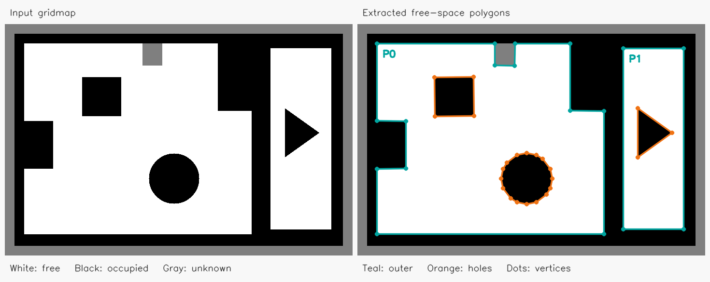

# 从 gridmap 提取多边形

`gridmap_to_polygon.cc` 是独立的 OpenCV C++ 示例，不需要 GUI、地图文件或机器人日志。
程序自行构造 720 × 480 的灰度栅格图，保存并重新读取图片，然后提取**可通行区域**：每个区域包含一个外环及零个或多个障碍物孔洞。

## 编译和运行

在项目根目录使用现有 CMake 构建目录：

```bash
cmake -S . -B build
cmake --build build --target gridmap_to_polygon -j2
./build/examples/gridmap_to_polygon
```

如果使用项目的 Conan Debug 配置：

```bash
cmake --preset conan-debug
cmake --build --preset conan-debug --target gridmap_to_polygon
./build/Debug/examples/gridmap_to_polygon
```

也可仅依赖系统 OpenCV 独立编译：

```bash
mkdir -p build
c++ -std=c++20 examples/gridmap_to_polygon.cc -o build/gridmap_to_polygon $(pkg-config --cflags --libs opencv4)
./build/gridmap_to_polygon
```

可通过唯一的位置参数指定输出目录，例如 `./build/examples/gridmap_to_polygon /tmp/gridmap-demo`。默认输出到当前工作目录下的 `examples/gridmap_polygon_output/`，重复运行会覆盖该目录下的四个同名结果文件。

## 地图和提取步骤

1. 构造地图：白色 `255` 表示可通行，黑色 `0` 表示障碍物，灰色 `127` 表示未知。地图有两个独立房间、三个内部障碍物，以及凹边界和未知区域造成的缺口。
2. `cv::compare(input, 255, ..., cv::CMP_EQ)` 生成自由空间掩码；未知区域不会当作可通行区域。
3. `cv::findContours(..., cv::RETR_CCOMP, cv::CHAIN_APPROX_SIMPLE)` 提取轮廓和两层父子关系。父节点为外环，子节点为孔洞；不能仅用 `RETR_EXTERNAL`，否则会丢失内部障碍物。
4. `cv::approxPolyDP(..., 2.0, true)` 用 2 像素容差简化闭合轮廓，圆形障碍物也会变成多边形。保留每个独立区域及其孔洞；障碍物内的自由岛也可作为独立外环处理。
5. 输出坐标和对比图，青色为外环、橙色为孔洞、圆点为多边形顶点。

## 输出

- `gridmap.png`：自行构造的原始灰度地图。
- `free_mask.png`：自由空间二值掩码。
- `preview.png`：原图和提取结果并排展示。
- `polygons.json`：地图尺寸、分辨率、原点，以及每个多边形的 `outer` / `holes`。每个环都有 `pixels` 和 `world_m` 两种坐标，首点不在末尾重复，闭合边由末点连接首点。



示例分辨率为 `0.05 m/格`，世界原点为地图左下角 `(-2, -1) m`，且地图无旋转。像素坐标 `(u, v)` 从左上角起算，转换为边界栅格中心的世界坐标：

```text
x = -2 + (u + 0.5) * 0.05
y = -1 + (height - v - 0.5) * 0.05
```

世界坐标下外环逆时针、孔洞顺时针。OpenCV 轮廓经过边界像素中心，并非精确栅格边缘；简化还会带来几何误差。本示例没有执行机器人半径膨胀，也不保证简化结果保守或在任意复杂地图上保持拓扑，实际覆盖规划前应做安全间距处理和几何有效性检查。单点、单线等无法形成非零面积多边形的轮廓会明确报错。

接入实际灰度地图时，替换 `make_gridmap()` / 图片读取部分，并按实际编码调整自由空间判定、分辨率和原点。ROS occupancy 值（未知 `-1`、空闲 `0`、占用 `100`）需要先映射，不能直接套用此处的灰度阈值。
